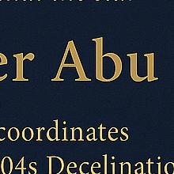

<!DOCTYPE html>
<html lang="ar" dir="rtl">
<head>
    <meta charset="UTF-8">
    <meta name="viewport" content="width=device-width, initial-scale=1.0">
    <title>نجمة Walaa Nasser Abu Dais</title>
    
</head>
<body>
    <header>
        <h1>🌟 نجمة Walaa Nasser Abu Dais 🌟</h1>
        
الإحداثيات: RA 19h 28m 42.04s | Dec +18° 47′ 55.1″

        
        
تمت تسمية هذه النجمة تكريمًا لميلادك في 15 أغسطس 2005

    </header>

    <!-- خريطة السماء التفاعلية -->
    <iframe src="https://stellarium-web.org/">
    </iframe>
</body>
</html>
